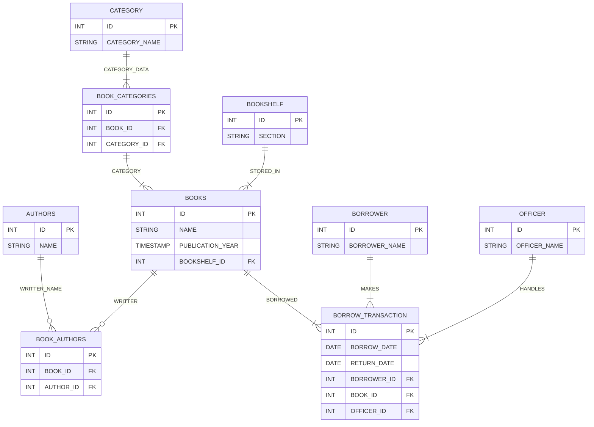

# ERD Library

<!-- 1 KATEGORI BISA BANYAK BUKU -->
<!-- 1 BUKU DI SATU RAK -->
<!-- suatu data sudah direpresentasikan oleh entitas lain, maka di tabel kita cukup menyimpan FK-nya saja, tidak perlu mengulang datanya. -->
